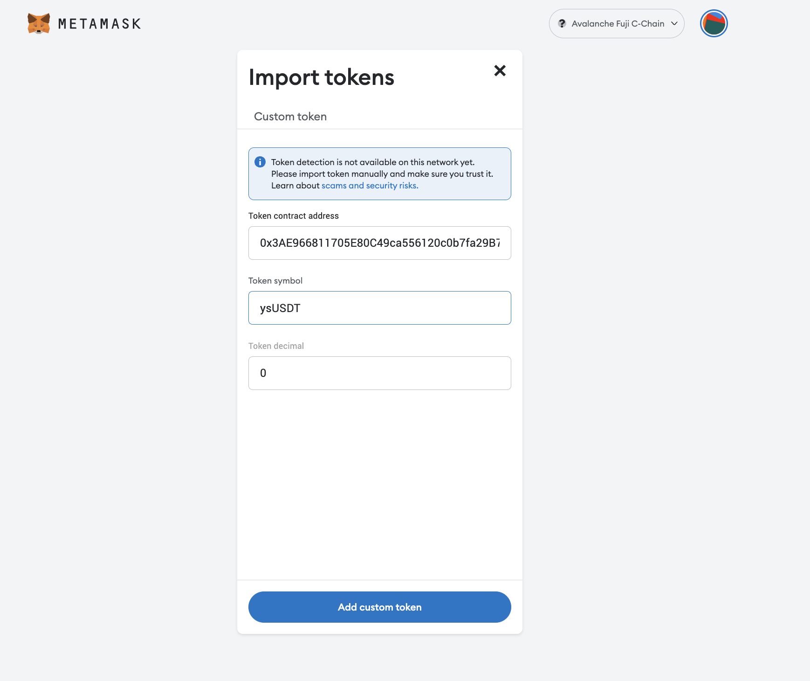

# 🦊 Network Configuration & Test Token Request

### Step1: Network Configuration (MetaMask)

* **Add Avalanche to your network configuration**. If you just downloaded the MetaMask wallet extension, it will be configured to[ Ethereum](https://academy.binance.com/en/articles/what-is-ethereum) by default. This won’t work with Avalanche Chain DApps so please click “Add Network”.
* On the Settings page, manually add the Avalanche Fuji Test Network with the following info ([official Avalanche network info](https://docs.avax.network/dapps/smart-contracts/deploy-a-smart-contract-on-avalanche-using-remix-and-metamask)):&#x20;


**Fuji Testnet Settings:**[**​**](https://docs.avax.network/dapps/smart-contracts/deploy-a-smart-contract-on-avalanche-using-remix-and-metamask#fuji-testnet-settings)

* **Network Name**: Avalanche Fuji C-Chain
* **New RPC URL**: [https://api.avax-test.network/ext/bc/C/rpc](https://api.avax-test.network/ext/bc/C/rpc)
* **ChainID**: `43113`
* **Symbol**: `AVAX`
* **Explorer**: [https://testnet.snowtrace.io/](https://testnet.snowtrace.io/)


<figure><figcaption></figcaption></figure>

### Step 2: Import ysUSDT Test Tokens


Token Contract Address: 0x3AE966811705E80C49ca556120c0b7fa29B75360

Token Symbol: ysUSDT


Please fill in the information to "add custom token" and then click “ Import Tokens” to display the test ysUSDT tokens on your MetaMask.&#x20;

<figure><figcaption></figcaption></figure>

### Step3: Claim AVAX Gas Fees

Go to [https://faucet.avax.network/](https://faucet.avax.network/) to claim AVAX test tokens as gas fee.

<figure><figcaption></figcaption></figure>

