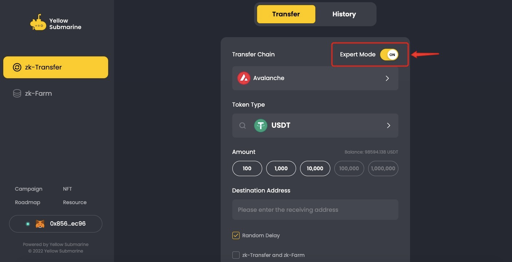

# 👨💻 ZK Transfer Tutorial (Expert Mode)

In "Expert Mode," you can engage in more professional and private on-chain transactions by setting a fixed **Discrete Amount** and **Random Delay**. To perform a ZK Transfer using this mode, follow the steps below:

1. Go to YS testnet page and connect your MetaMask wallet, configure to the Avalanche testnet.

<figure><figcaption></figcaption></figure>

2. Switch to "Expert Mode".&#x20;

<figure><figcaption></figcaption></figure>

3. Input the transfer details for your ZK Transfer.&#x20;

* In "Expert Mode," you can choose from specified Discrete amounts such as 100, 1000, 10000, etc. You must select one of the Discrete Amounts displayed on the page for the trade.
* By default, "Expert Mode" automatically selects the "Random delay" option. This introduces a delay in the transaction to enhance privacy. If you find the wait time too long, you have the option to deselect this feature.

<figure><figcaption></figcaption></figure>

5. Confirm the transaction information, including the Transaction Fee, and click "Next."

<figure><figcaption></figcaption></figure>

6. It is recommended to "Download" the Encrypted Private Key Backup. This backup will assist in recovering your transferred assets in case of any transfer errors. Sign in to your wallet and reconfirm the details.

<figure><figcaption></figcaption></figure>

7. After successfully downloading the Encrypted Private Key Backup, click "Confirm."

<figure><figcaption></figcaption></figure>

8. The ZK Transfer will now be processed. It is important not to close the Yellow Submarine page and patiently wait for the process to complete. During the process, you may be required to confirm deposit requests on your MetaMask wallet.

<figure><figcaption></figcaption></figure>

9. The ZK Transfer typically takes around 5 minutes to complete. Once finished, you can find the transaction details for each step of the ZK Transfer on the Avalanche testnet explorers and the YS explorer. Additionally, you can view the time of the random delay.

<figure><figcaption></figcaption></figure>
